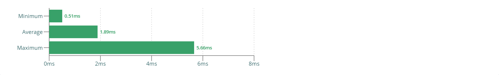
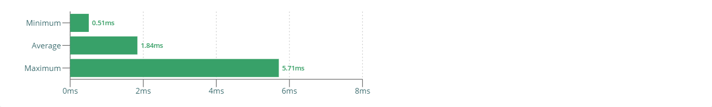

<div align="center">

# react-scheduling-experiment

Using custom scheduling in **[React](https://github.com/facebook/react)**.

</div>

<br><br>

## What is scheduling?

TODO

<br><br>

## Scheduling in React

### Automatic scheduling in React

Within scopes known to React - such as a `useEffect()` hook body or an event handler function - all synchronous function calls that
manipulate state (using the `useState()` hook) will be batched up automatically, thus leading to only a single scheduled re-render instead
of potentially multiple ones. [[1](https://reactjs.org/docs/faq-state.html#when-is-setstate-asynchronous),
[2](https://overreacted.io/react-as-a-ui-runtime/),
[3](https://github.com/facebook/react/issues/16387#issuecomment-521623662)]

For instance:

```ts
// State
const [value, setValue] = useState('');
const [otherValue, setOtherValue] = useState('');
const [thisValue, setThisValue] = useState('');
const [thatValue, setThatValue] = useState('');

// Side effects
useEffect(() => {
  setOtherValue(`other ${value}.`);
  setThisValue(`this ${value}.`);
  setThatValue(`that ${value}.`);
}, [value]);
```

Let's assume we update the value, e.g. within an event handler. For instance:

```ts
setValue('cool value');
```

Now, the following re-renderings happen:

<table>
  <thead>
    <tr>
      <th>Render</th>
      <th>Description</th>
    </tr>
  </thead>
  <tbody>
    <tr>
      <td style="vertical-align: top">1</td>
      <td style="vertical-align: top">
        Calling <code>setValue('cool value')</code> will lead to the <code>value</code> state variable being updated by the
        <code>useState()</code> hook. Because updating state via the <code>useState()</code> hook will always trigger a re-render - at least
        if the value has actually changed, which in our case it did - React triggers a re-render.
      </td>
    </tr>
    <tr>
      <td style="vertical-align: top">2</td>
      <td style="vertical-align: top">
        Our <code>useEffect()</code> hook lists the <code>value</code> state variable as a dependency. Thus, changing the <code>value</code>
        state variable value will always lead to the <code>useEffect()</code> hook being executed. Within our <code>useEffect()</code> hook,
        we update three other state variables (again, based on `useState()`). Now: React has enough context for optimization: It knows what
        <code>useEffect()</code> is and does, and it has full control over / executes <code>useEffect()</code>. Thus, React intelligently
        batches up all three state changes instead of executing them directly, thus scheduling a single re-render instead of three separate
        ones.
      </td>
    </tr>
  </tbody>
</table>

<br>

### No automatic scheduling in asynchronous `useEffect()`s / event handlers

Now, things are different when asynchronous operations (e.g. promises, timeouts, RxJS, ...) come into play.

For instance:

```ts
// State
const [value, setValue] = useState('');
const [otherValue, setOtherValue] = useState('');
const [thisValue, setThisValue] = useState('');
const [thatValue, setThatValue] = useState('');

// Side effects
useEffect(() => {
  Promise.resolve().then(() => {
    setOtherValue(`other ${value}.`);
    setThisValue(`this ${value}.`);
    setThatValue(`that ${value}.`);
  });
}, [value]);
```

Let's assume we update the value, e.g. within an event handler. For instance:

```ts
setValue('cool value');
```

Now, the following re-renderings happen:

<table>
  <thead>
    <tr>
      <th>Render</th>
      <th>Description</th>
    </tr>
  </thead>
  <tbody>
    <tr>
      <td style="vertical-align: top">1</td>
      <td style="vertical-align: top">
        Calling <code>setValue('cool value')</code> will lead to the <code>value</code> state variable being updated by the
        <code>useState()</code> hook. Because updating state via the <code>useState()</code> hook will always trigger a re-render - at least
        if the value has actually changed, which in our case it did - React triggers a re-render.
      </td>
    </tr>
    <tr>
      <td style="vertical-align: top">2, 3, 4</td>
      <td style="vertical-align: top">
        Our <code>useEffect()</code> hook lists the <code>value</code> state variable as a dependency. Thus, changing the <code>value</code>
        state variable value will always lead to the <code>useEffect()</code> hook being executed. Within our <code>useEffect()</code> hook,
        we update three other state variables (again, based on <code>useState()</code>) once our promise resolves. Now: Due to our side
        effects being executed asynchronously (once the promise resolves), React does no longer have enough context for optimizations. Thus,
        in order to ensure that nothing breaks, React has no other choice than executing all state changes as per usual, leading to three
        separate re-renders.
      </td>
    </tr>
  </tbody>
</table>

<br>

### No automatic scheduling across chained `useEffect()`s

Also: Automatic batching / scheduling only works within each `useEffect()` body, not across multiple `useEffect()`s. If you have side
effects leading to new state that then triggers side effects - basically a chain of `useEffects()` - React is not able to optimize this as
it is too unpredicable.

For instance:

```ts
// State
const [value, setValue] = useState('');
const [otherValue, setOtherValue] = useState('');
const [thisValue, setThisValue] = useState('');

// Side effects
useEffect(() => {
  setOtherValue(`other ${value}.`);
}, [value]);
useEffect(() => {
  setThisValue(`this ${value}.`);
}, [otherValue]);
```

Let's assume we update the value, e.g. within an event handler. For instance:

```ts
setValue('cool value');
```

Now, the following re-renderings happen:

<table>
  <thead>
    <tr>
      <th>Render</th>
      <th>Description</th>
    </tr>
  </thead>
  <tbody>
    <tr>
      <td style="vertical-align: top">1</td>
      <td style="vertical-align: top">
        Calling <code>setValue('cool value')</code> will lead to the <code>value</code> state variable being updated by the
        <code>useState()</code> hook. Because updating state via the <code>useState()</code> hook will always trigger a re-render - at least
        if the value has actually changed, which in our case it did - React triggers a re-render.
      </td>
    </tr>
    <tr>
      <td style="vertical-align: top">2</td>
      <td style="vertical-align: top">
        Our first <code>useEffect()</code> hook lists the <code>value</code> state variable as a dependency. Thus, changing the
        <code>value</code> state variable value will always lead to the <code>useEffect()</code> hook being executed. Within our
        <code>useEffect()</code> hook, we update the <code>otherValue</code> state variables (again, based on <code>useState()</code>). This
        will lead to a re-render.
      </td>
    </tr>
    <tr>
      <td style="vertical-align: top">3</td>
      <td style="vertical-align: top">
        Our second <code>useEffect()</code> hook has the <code>otherValue</code> state variable as its dependency. Thus, the first
        <code>useEffect()</code> changing the <code>otherValue</code> state variable value will always lead to the second
        <code>useEffect()</code> hook being executed. Within our  second <code>useEffect()</code> hook, we update the other two state
        variables (again, based on `useState()`). This will, again, lead to a re-render.
      </td>
    </tr>
  </tbody>
</table>

<br><br>

## Manual scheduling in React

React itself (like many frontend frameworks) hides most of its implementation details and low-level APIs from us, so that we can concentrate
on building applications rather than deep diving into React internals. This also applies to the render pipeline and its scheduling
mechanisms.

<br>

### The `unstable_batchedUpdates` API

Luckily for us, though, React actually does expose _one_ API that enables us to group / batch renderings: `unstable_batchedUpdates`.

However, this API, like a few others React exposes, is prefixed with `unstable` - meaning it this AP not part of the public
React API and thus might change or even break with any future release. But, the `unstable_batchedUpdates` API is the most "stable unstable"
React APIs out there (see [this tweet](https://twitter.com/dan_abramov/status/1103399900371447819)), and many popular projects rely upon it
(e.g. [React Redux](https://react-redux.js.org/api/batch)). So it's pretty safe to use.

So, it's pretty safe to use? For now, yes. Should it get removed at some point (e.g. React 17) we just need to remove the
`unstable_batchedUpdates` optimzations and - while performance might worsen - our code continues to work just fine. With the upcoming
[Concurrent Mode](https://reactjs.org/docs/concurrent-mode-intro.html), chances are good that the `unstable_batchedUpdates` API might
actually become useless anyways as React will be intelligent enough to do most of the optimizations on its own. Until then,
`unstable_batchedUpdates` is the way to go.

<br>

### Scheduling synchronously

In the rather simple use cases, we can use `unstable_batchedUpdates` right away. A common scenario is running asynchronous code in a
`useEffect()` hook, and in that situation we can wrap all state change function calls in a single `unstable_batchedUpdates`. This scheduling
is synchronous, as React will render changes right away instead of sometimes later in the current task.

For instance:

```diff
  useEffect(() => {
    Promise.resolve().then(() => {
+     unstable_batchedUpdates(() => {
        setOtherValue(`other ${value}.`);
        setThisValue(`this ${value}.`);
        setThatValue(`that ${value}.`);
+     });
    });
  }, [value]);
```

#### Alternative: Combined state

Sometimes, for example if all state lives in the same component, it's just easier to combine multiple `useState()`s into a single
`useState()`, e.g. by combining state into an object.

For instance:

```diff
  useEffect(() => {
    Promise.resolve().then(() => {
+     unstable_batchedUpdates(() => {
-       setOtherValue(`other ${value}.`);
-       setThisValue(`this ${value}.`);
-       setThatValue(`that ${value}.`);
+       setAdditionalValues({
+         otherValue: `other ${value}.`,
+         thisValue: `this ${value}.`,
+         thatValue: `that ${value}.`
+       });
+     });
    });
  }, [value]);
```

<br>

### Scheduling asynchronously / distributed

Other times, we simply cannot batch updates synchronously, or we do not want to.

#### Use Case: Using RxJS

One use case where we cannot synchronously batch updates is when using [RxJS](https://github.com/ReactiveX/rxjs) to share and manage data
across multiple components. Somewhere up the hierarchy, an Observable exists that emits data, and multiple components subscribe to that
Observable to retrieve the data.

For instance:

```tsx
const [value, setValue] = useState('');
const dataStream = useMyObservable();

useEffect(() => {
  // Update value when it changes
  const subscription = dataStream.subscribe((newValue) => {
    setValue(newValue);
  });

  // Cleanup
  return () => {
    subscription.unsubscribe();
  };
});
```

Now, in this example we basically opt-out of React features; we do not use a [React Context](https://reactjs.org/docs/context.html) to
manage and distribute data across multiple components, but we instead use our own solution. Thus, React has no way of knowing how to
optimize here. Even though the original data source (here our Observable) only emits data once - at the same time, to all components using
it - React will re-render every single component separately.

#### Render scheduler requirements

The solution to this problem is a custom scheduling solution that batches up multiple render instructions (from multiple components). This
custom scheduler

- ideally exist once at a central place, and is shared across components<br>
  → we can provide the render scheduler using a React Context, or by exporting it as a singleton from a JavaScript module
- runs render instructions asynchronously, meaning after all synchronous component code has been executed<br>
  → we can use [Microtasks](https://developer.mozilla.org/en-US/docs/Web/API/HTML_DOM_API/Microtask_guide) to run our render instructions
  right after all synchronous code has been executed

> We are using Microtasks here to schedule renderings as early as possible. But it's also possible to use Tasks (e.g. `setTimeout()`) or
> even render-based queues (e.g. `requestAnimationFrame()`) for the purpose of render scheduling.

#### An exemplary render scheduler using Microtasks and `unstable_batchedUpdates`

The following is an example implementation of such a render scheduler. Using the `scheduleTask()` function, components can wrap their state-
changing code similar to just using `unstable_batchedUpdates`. The render scheduler will remember all those tasks, and queue (scheduling) a
microtask. Once the browser has executed all synchronous code and continues to run all queued microtasks, it will pick up the render
scheduler microtask which will then execute all remembered tasks, wrapped within a unstable_batchedUpdates` function.

Render scheduler:

```ts
import { unstable_batchedUpdates as batchedUpdates } from 'react-dom';

/**
 * Render Scheduler
 */
export class RenderScheduler {
  /**
   * List of scheduled tasks
   */
  private scheduledTasks: Array<Function>;

  /**
   * Flag, describing whether the next render has already been scheduled
   */
  private isNextRenderScheduled: boolean;

  /**
   * Constructor
   */
  constructor() {
    this.scheduledTasks = [];
    this.isNextRenderScheduled = false;
  }

  /**
   * Schedule a new task
   *
   * @param task Task
   */
  public scheduleTask(task: Function): void {
    // Schedule the task
    this.scheduledTasks.push(task);

    // Schedule the next render (if not yet done)
    if (!this.isNextRenderScheduled) {
      this.scheduleTaskExecution();
    }
  }

  /**
   * Schedule task execution
   */
  private async scheduleTaskExecution(): Promise<void> {
    // Mark next render as scheduled
    this.isNextRenderScheduled = true;

    // Wait until next opportunity to render
    queueMicrotask((): void => {
      // Unmark next render as scheduled
      this.isNextRenderScheduled = false;

      // Get tasks to be applied
      const scheduledTasksToBeApplied: Array<Function> = this.scheduledTasks;
      this.scheduledTasks = [];

      // Run all tasks batched (and in correct order)
      batchedUpdates((): void => {
        for (let i = 0; i < scheduledTasksToBeApplied.length; i++) {
          scheduledTasksToBeApplied[i]();
        }
      });
    });
  }
}
```

Assuming the `RenderScheduler` above has been instantiated in a Context and gets provided via the `useRenderScheduler()` hook, components
can now schedule render tasks the following way:

```diff
  const [value, setValue] = useState('');
  const dataStream = useMyObservable();
+ const renderScheduler = useRenderScheduler();

  useEffect(() => {
    // Update value when it changes
    const subscription = dataStream.subscribe((newValue) => {
+     renderScheduler.scheduleTask(() => {
        setValue(newValue);
+     });
    });

    // Cleanup
    return () => {
      subscription.unsubscribe();
    };
  });
```

<br><br>

## Performance Analysis Setup

### Test setup

Of course, we want to get meaningful and consistent results when performance analysis each use case implementation. The following has been
done to ensure this:

- **All use case implementations are completely separated from each other.**
  <br>
  Sure, it's a lot of duplicate code and tons of storage used by `node_modules` folders, but it keeps things clean. In particular:
  - Each use case implementation exists within a separete folder, and no code gets shared between use cases. This way, we can ensure that
    the implementation is kept to the absolute minimum, e.g. only the relevant scheduler, no unnecessary logic or "pages".
  - Each use case defines and installs its own dependencies, and thus has its own `node_modules` folder. This way, we can easily run our
    performance analysis tests using different dependencies per use case, e.g. using a newer / experimental version of React.
- **Performance analysis happens on a production build of the application.**
  <br>
  That's the version our users will see, so that's the version we should test. In particular:
  - Production builds might perform better (or at least different) than development builds due things like tree shaking, dead code
    elimination and minification.
  - React itself actually does additional things in development mode that do affect performance, e.g.
    [running additional checks or showing development warnings](https://reactjs.org/docs/optimizing-performance.html#use-the-production-build).
- **Performance analysis happens with the exact same clean browser.**
  <br>
  Let's keep variations to a minimum. In particular:
  - We use the exact same version of Chrome for all tests, ensuring consistent results.
  - We use a clean version of Chrome so that things like user profiles, settings or extensions / plugins don't affect the results.

While all this certainly helps getting solid test results, there will always be things out of our control, such as:

- Browser stuff (e.g. garbage collection, any internal delays)
- Software stuff (Windows, software running in the background)
- Hardware stuff (CPU, GPU, RAM, storage)

All the performance profiling results documented below ran on the following system:

| Area             | Details                                               |
| ---------------- | ----------------------------------------------------- |
| CPU              | Intel Core i7 8700K 6x 3.70Ghz                        |
| RAM              | 32GB DDR4-3200 DIMM CL16                              |
| GPU              | NVIDIA GeForce GTX 1070 8GB                           |
| Storage          | System: 512GB NVMe M.2 SSD, Project: 2TB 7.200rpm HDD |
| Operating System | Windows 10 Pro, Version 1909, Build 18363.778         |

<br>

### Test implementation

Running a performance analysis test means:

| Step | Description                                                                 |
| ---- | --------------------------------------------------------------------------- |
| 1    | Start the server that serves the frontend application build locally         |
| 2    | Start the browser, and navigate to the URL serving the frontend application |
| 3    | Start the browser performance profiler recording                            |
| -    | Wait for the test to finish                                                 |
| 4    | Stop the browser performance profiler recording                             |
| 5    | Write results to disk                                                       |
| 6    | Close browser                                                               |
| 7    | Close server                                                                |

TOOD: Results files
TODO: puppeteer

<br>

### Visualize test results

TODO

<br><br>

## Performance Analysis Results

### Without scheduling

TODO

#### Results

Timeline:


Update durations:


Render durations:


Tracing:

TODO

<br>

### Synchronous scheduling by manual flush

TODO

#### Results

Timeline:


Update durations:


Render durations:


Tracing:

TODO

<br>

### Asynchronous scheduling using Microtasks

TODO

#### Results

Timeline:


Update durations:


Render durations:


Tracing:

TODO

<br>

### Asynchronous scheduling using Macrotasks

TODO

#### Results

Timeline:


Update durations:



Render durations:


Tracing:

TODO

<br>

### Asynchronous scheduling based on the render cycle

TODO

#### Results

Timeline:


Update durations:



Render durations:


Tracing:

TODO

<br>

### Bonus: Concurrent Mode

TODO

#### Results

Timeline:


Update durations:


Render durations:


Tracing:

TODO
